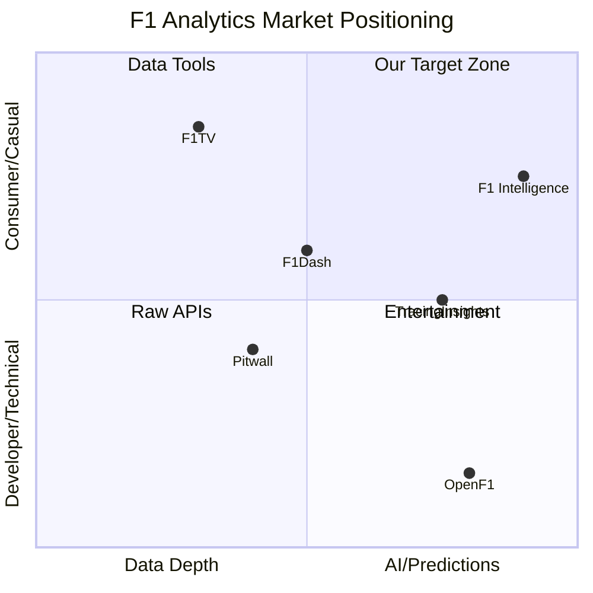

# F1 Analytics Platform Competitor Analysis

> **Last Updated:** January 22, 2026  
> **Analyst:** AI Competitive Research Agent  
> **Purpose:** Identify gaps and opportunities for F1 Intelligence Platform differentiation

---

## Executive Summary

The F1 analytics market is fragmented across five main categories:
1. **Official Streaming** (F1TV) - Premium live content, expensive
2. **Community Analytics** (TracingInsights, F1Dash) - Free, data-focused
3. **API Providers** (OpenF1) - Developer-focused, raw data
4. **Historical Databases** (Pitwall) - Reference and lookup tools
5. **Enterprise Solutions** (AWS F1 Insights) - Broadcast graphics only

**Key Opportunity:** No competitor offers a unified platform combining **predictive AI**, **strategy simulation**, **live data**, and **premium UX** in a single experience.

---

## Competitor Comparison Matrix

| Feature | F1TV | TracingInsights | F1Dash | OpenF1 | Pitwall | **F1 Intelligence (Ours)** |
|---------|------|-----------------|--------|--------|---------|---------------------------|
| **Live Timing** | ✅ Pro | ✅ Free | ✅ Free | ✅ API | ❌ | ✅ Free |
| **Race Predictions** | ❌ | ❌ | ❌ | ❌ | ❌ | ✅ AI-Powered |
| **Strategy Simulator** | ❌ | ❌ | ❌ | ❌ | ❌ | ✅ Interactive |
| **Driver vs Driver** | ❌ | ✅ Charts | ❌ | ❌ | ✅ Stats | ✅ Visual + AI |
| **Championship Simulator** | ❌ | ✅ Basic | ❌ | ❌ | ❌ | ✅ Scenario Builder |
| **Onboard Cameras** | ✅ 20 feeds | ❌ | ❌ | ❌ | ❌ | ❌ |
| **Telemetry Charts** | ❌ | ✅ Detailed | ✅ Limited | ✅ Raw | ❌ | ✅ Premium |
| **Historical Data** | ✅ Archive | ✅ 2018+ | ❌ | ✅ 2023+ | ✅ 1950+ | ✅ Full |
| **Lap Time Predictor** | ❌ | ❌ | ❌ | ❌ | ❌ | ✅ ML Model |
| **Safety Car Probability** | ❌ | ❌ | ❌ | ❌ | ❌ | ✅ Premium |
| **UI Quality** | ⭐⭐⭐⭐ | ⭐⭐⭐ | ⭐⭐ | ⭐ | ⭐⭐ | ⭐⭐⭐⭐⭐ (Target) |
| **Mobile App** | ✅ | ❌ | ❌ | ❌ | ❌ | 🔜 Planned |
| **Pricing** | $129.99/yr | Free | Free | Free | Free | Freemium |

---

## Detailed Competitor Analysis

---

### 1. F1TV (Official)

**URL:** [f1tv.formula1.com](https://f1tv.formula1.com)

#### Overview
The official Formula 1 streaming platform. Recently launched **F1 TV Premium** tier (March 2025) with 4K Ultra HD/HDR support.

#### Core Features
- **Live Race Streaming** - All sessions (FP1-FP3, Quali, Sprint, Race)
- **20 Onboard Cameras** - Driver POV feeds
- **Live Team Radios** - Real-time pit wall communications  
- **Multiview Feature** - Custom layouts combining feeds + timing
- **F2/F3/F1 Academy** - Full feeder series coverage
- **Race Archive** - Historical race replays

#### Pricing Model
| Tier | Price (US) | Key Features |
|------|------------|--------------|
| F1 TV Pro | Discontinued | Was $79.99/yr |
| F1 TV Premium | **$129.99/yr** | 4K HDR, Multiview, 6 devices |
| Apple TV Bundle | TBD (2026) | F1TV via Apple subscription |

> [!WARNING]
> **Major Changes for 2026:** F1TV is being bundled with Apple TV in the USA. Standalone Pro subscriptions ending. This creates uncertainty for fans.

#### UI Patterns
- **Colors:** Black/Red theme matching F1 brand
- **Timing Tower:** Classic F1 broadcast style with driver colors
- **Layout:** Video-centric with timing overlay options

#### What They Do Better
- ✅ **Official data source** - No delay, authoritative
- ✅ **Video content** - Only place for live onboard cameras
- ✅ **Production quality** - Broadcast-grade experience
- ✅ **Mobile apps** - Native iOS/Android/Smart TV

#### Gaps We Can Exploit
- ❌ **No predictive analytics** - Shows data, doesn't analyze it
- ❌ **No strategy simulation** - Can't "what-if" scenarios
- ❌ **Expensive** - $129.99/yr prices out casual fans
- ❌ **No free tier** - All-or-nothing subscription
- ❌ **Data locked in video** - No programmatic access

---

### 2. TracingInsights

**URL:** [tracinginsights.com](https://tracinginsights.com)

#### Overview
The most comprehensive **free** F1 data analytics platform. Community-funded via GitHub Sponsors. Data available 30 minutes after sessions end.

#### Core Features
- **Lap Time Analysis** - Compare driver lap times with interactive charts
- **Telemetry Data** - Speed, throttle, brake traces
- **Stint Analysis** - Tire compound tracking, degradation patterns
- **Sector Analysis** - S1, S2, S3 breakdowns
- **Position Changes** - Lap-by-lap position evolution
- **Race Pace Comparisons** - Long run analysis
- **GG Plot** - Lateral/longitudinal acceleration
- **Circuit Maps** - Gear/speed visualizations
- **Tyre Strategy** - Compound choices and pit stops
- **Historical Data** - 2018-2026 seasons

#### Pricing Model
| Tier | Price | Access |
|------|-------|--------|
| Free | $0 | Full access to all features |
| Sponsor | Voluntary | Name on supporters wall |

#### UI Patterns
- **Colors:** Slate blue (#1E293B) primary, green accents
- **Layout:** Dashboard-style with dropdowns for year/event/session/driver
- **Charts:** Line charts, scatter plots, position graphs
- **Responsive:** Optimized for landscape on mobile

#### What They Do Better
- ✅ **Completely free** - No paywall
- ✅ **Deep analytics** - More data points than F1TV
- ✅ **Multi-driver comparison** - Side-by-side analysis
- ✅ **Community trust** - Beloved by r/formula1
- ✅ **Regular updates** - New analysis types added frequently

#### Gaps We Can Exploit
- ❌ **No predictions** - Historical/descriptive only
- ❌ **30-minute delay** - Not truly "live"
- ❌ **Dense UI** - Overwhelming for casual fans
- ❌ **No narrative** - Data without context
- ❌ **No mobile app** - Web-only experience
- ❌ **No strategy planning** - Can't simulate scenarios

---

### 3. F1Dash

**URL:** [f1-dash.com](https://f1-dash.com)

#### Overview
An **open-source hobby project** for real-time F1 timing. In "maintenance mode" as of 2025 due to F1's data access changes.

#### Core Features
- **Live Timing Dashboard** - Real-time leaderboard
- **Tire Tracking** - Compound and age visualization
- **Gap Calculations** - Intervals between drivers
- **Team Radio Alerts** - Notification of new radio messages

#### Pricing Model
**Free** - Open source project

#### UI Patterns
- **Colors:** Dark theme with F1 team colors
- **Design:** Minimalist timing tower focus
- **Logo:** Tag-style "f1-dash" branding

#### Current Limitations
> [!IMPORTANT]
> **Major Regression:** F1 changed data accessibility in 2024. Position data and car metrics now require subscription bypass. The developer explicitly states they won't implement "not so secure" login workarounds.

#### What They Do Better
- ✅ **Open source** - Fully transparent
- ✅ **Real-time** - No 30-minute delay
- ✅ **Simple** - Focus on timing only

#### Gaps We Can Exploit
- ❌ **Reduced functionality** - Lost position data
- ❌ **Maintenance mode** - No active development
- ❌ **No analytics** - Timing only, no insights
- ❌ **Web only** - No mobile experience
- ❌ **No historical data** - Live sessions only

---

### 4. OpenF1 API

**URL:** [openf1.org](https://openf1.org)

#### Overview
A **free, open-source REST API** for F1 data. No authentication required. Inspired by FastF1 Python package.

#### API Endpoints
```
/car_data      - Telemetry (RPM, speed, throttle, brake, gear, DRS)
/drivers       - Driver information
/intervals     - Gap to leader and ahead
/laps          - Lap times and sectors
/location      - Car GPS coordinates
/meetings      - Race weekend info
/pit           - Pit stop data
/position      - Race positions
/race_control  - Flags, safety car, VSC
/sessions      - Session metadata
/stints        - Tire compound usage
/team_radio    - Radio message URLs
/weather       - Temperature, humidity, wind
```

#### Data Coverage
- **Seasons:** 2023-2026
- **Delay:** ~1-2 seconds from live
- **Format:** JSON and CSV

#### Pricing Model
**Free** - Donation-supported via Buy Me A Coffee

#### What They Do Better
- ✅ **Developer-friendly** - Clean REST API
- ✅ **No rate limits** - Generous usage policy
- ✅ **Real-time capable** - Near-live data
- ✅ **Comprehensive** - 16+ endpoints

#### Gaps We Can Exploit
- ❌ **Raw data only** - No visualization
- ❌ **No predictions** - Historical descriptive data
- ❌ **Limited history** - Only 2023+
- ❌ **Technical audience** - Requires coding skills
- ❌ **No strategy tools** - API, not application

---

### 5. Pitwall

**URL:** [pitwall.app](https://pitwall.app)

#### Overview
A **historical F1 database** covering 1950-2025 seasons. Focus on standings, results, and lap time archives.

#### Core Features
- **Championship Standings** - WDC and WCC tables
- **Race Results** - Grid to finish positions
- **Lap Time Database** - Detailed lap data from 1996+
- **Driver Profiles** - Career statistics
- **Constructor Profiles** - Team history
- **Season Overviews** - Annual summaries

#### Pricing Model
**Free** - Ad-supported

#### UI Patterns
- **Colors:** Clean white theme with minimal accents
- **Layout:** Table-heavy, traditional web design
- **Data Presentation:** Sortable tables, basic styling

#### What They Do Better
- ✅ **Deep history** - 75 years of data (1950-2025)
- ✅ **Comprehensive results** - Every race, every driver
- ✅ **Clean data** - Well-organized tables

#### Gaps We Can Exploit
- ❌ **Static content** - No live data
- ❌ **No predictions** - Purely historical
- ❌ **Basic UI** - Utilitarian design
- ❌ **No analytics** - Reference tool, not analysis
- ❌ **No interactivity** - Can't simulate or compare

---

## Market Positioning Analysis

### Competitor Positioning Map



### Competitive Advantages by Feature

| Our Feature | No Competitor Has This |
|-------------|------------------------|
| **Race Outcome Predictor** | ML-powered pre-race predictions |
| **Championship Simulator** | "What-if" scenario builder |
| **Strategy Optimizer** | Pit stop timing recommendations |
| **Lap Time Predictor** | Qualifying/race lap forecasts |
| **Safety Car Probability** | Risk assessment per circuit |
| **Driver vs Driver AI** | Beyond stats: performance context |
| **Sandbox Mode** | Create hypothetical matchups |
| **Premium UX** | Cinematic, Apple-level design |

---

## Gaps & Opportunities Summary

### 🎯 Primary Differentiators

1. **Predictive Intelligence**
   - No competitor offers forward-looking AI predictions
   - Market gap: "What will happen?" vs "What did happen?"

2. **Strategy Tools**
   - Simulation and optimization are completely absent
   - Opportunity: Help fans think like strategists

3. **Premium Experience**
   - TracingInsights = functional but dense
   - F1TV = video-focused, not data-interactive
   - Opportunity: Apple/F1 broadcast-quality UI for data

4. **Freemium Model**
   - F1TV = expensive ($129.99)
   - Community tools = limited features
   - Opportunity: Free core + Premium AI features

### 🚫 What NOT to Compete On

1. **Live Video** - F1TV has exclusive rights
2. **Raw API** - OpenF1 serves developers well
3. **Deep History** - Pitwall covers 1950-present
4. **Open Source** - Not our business model

### 📊 Feature Priority Recommendations

| Priority | Feature | Justification |
|----------|---------|---------------|
| P0 | Race Outcome Predictor | Unique differentiator, viral potential |
| P0 | Championship Simulator | Highest engagement, "what-if" addiction |
| P0 | Live Timing Tower | Table stakes for race day traffic |
| P1 | Driver vs Driver | Fan favorite comparison tool |
| P1 | Strategy Optimizer | Premium upsell opportunity |
| P1 | Premium UX/Animations | Brand differentiation |
| P2 | Lap Time Predictor | Quali/race forecasting |
| P2 | Safety Car Calculator | Unique, data-driven |
| P3 | Mobile App | Long-term investment |
| P3 | Sandbox Mode | Power user feature |

---

## Pricing Strategy Recommendations

### Competitive Pricing Analysis

| Platform | Free | Paid | Our Position |
|----------|------|------|--------------|
| F1TV | ❌ | $129.99/yr | Undercut significantly |
| TracingInsights | ✅ Full | ❌ | Match free features |
| F1Dash | ✅ Full | ❌ | Match free features |
| OpenF1 | ✅ Full | ❌ | Different audience |
| Pitwall | ✅ Full | ❌ | Match free features |

### Recommended Pricing Model

| Tier | Price | Features |
|------|-------|----------|
| **Free** | $0 | Race Predictor, Championship Sim, Driver Comparison, Live Standings, Race Week Hub |
| **Pro** | $4.99/mo or $39.99/yr | Lap Time Predictor, Strategy Optimizer, Sandbox Mode, Historic Data, Safety Car Probability, Ad-free |

**Rationale:**
- Free tier matches/exceeds TracingInsights to capture community
- Pro at $40/yr is 70% cheaper than F1TV Premium
- Monthly option for casual race-weekend fans

---

## Key Takeaways

### 🏆 Our Winning Formula

1. **AI-First** - Only platform with predictive intelligence
2. **Premium Design** - Cinematic UX that matches the sport's prestige
3. **Accessible** - Free core features, affordable premium
4. **Fan-Focused** - Tools that make fans feel like strategists

### 🎯 Tagline Validation

> *"RACE INTELLIGENCE REDEFINED"*

This tagline effectively positions us against:
- F1TV = "Watch Intelligence" (passive)
- TracingInsights = "Historical Intelligence" (backward-looking)
- **F1 Intelligence** = "Race Intelligence" (forward-looking, active)

### 📈 Success Metrics to Track

| Metric | Target | Benchmark |
|--------|--------|-----------|
| Free User Signups | 10K in 3 months | TracingInsights ~50K visitors/race |
| Pro Conversion | 5% of free users | Industry standard 2-5% |
| Race Day DAU | 50% of registered | Peak engagement window |
| Prediction Accuracy | 80%+ for podium | Academic F1 models ~70% |

---

## Appendix: Data Sources

| Source | Data Used | Access Method |
|--------|-----------|---------------|
| f1tv.formula1.com | Feature list, pricing | Firecrawl scrape |
| tracinginsights.com | Feature list, UI patterns | Firecrawl scrape |
| f1-dash.com | Feature list, status | Firecrawl scrape |
| openf1.org | API documentation | Firecrawl scrape |
| pitwall.app | Feature list, data coverage | Firecrawl scrape |
| formula1.com | F1TV Premium details | Exa search |
| racefans.net | F1TV pricing confirmation | Exa search |
| aws.amazon.com/sports/f1 | F1 Insights info | Exa search |

---

*Document generated for F1 Intelligence Platform strategic planning.*
