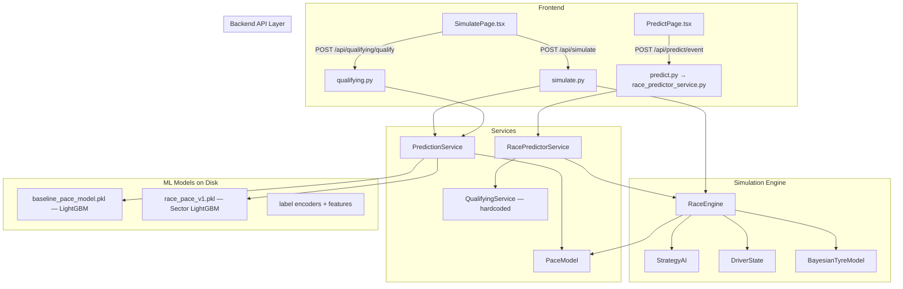
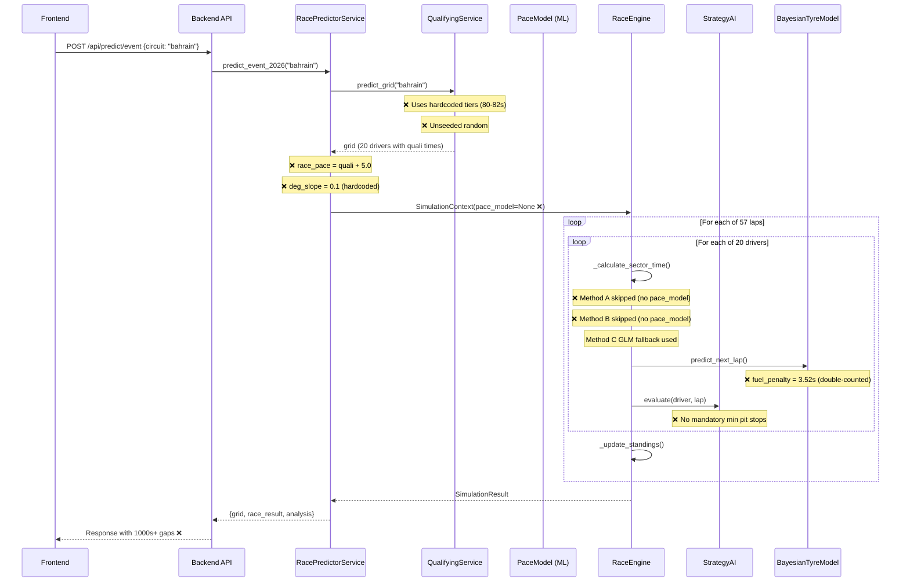

# F1 Race Intelligence — Simulation Architecture Guide

> Complete reference for how every piece of the simulation works, all bugs found, and the exact fix for each.

---

## Table of Contents

1. [High-Level Architecture](#1-high-level-architecture)
2. [The Two API Flows](#2-the-two-api-flows)
3. [Qualifying Simulation — Deep Dive](#3-qualifying-simulation--deep-dive)
4. [Race Simulation — Deep Dive](#4-race-simulation--deep-dive)
5. [ML Models — What Exists & How They Work](#5-ml-models--what-exists--how-they-work)
6. [All Bugs Found](#6-all-bugs-found)
7. [Fix Guide — Step by Step](#7-fix-guide--step-by-step)

---

## 1. High-Level Architecture



### Key Files

| File | Purpose |
|------|---------|
| [simulate.py](file:///c:/Users/shahj/Dev/Personal/F1-Intelligence-Model/backend/app/api/simulate.py) | `/api/simulate` — direct simulation API, injects `pace_model` ✅ |
| [qualifying.py](file:///c:/Users/shahj/Dev/Personal/F1-Intelligence-Model/backend/app/api/qualifying.py) | `/api/qualifying/qualify` — ML-based qualifying API |
| [race_predictor_service.py](file:///c:/Users/shahj/Dev/Personal/F1-Intelligence-Model/backend/app/services/race_predictor_service.py) | Prediction flow coordinator — **does NOT inject pace_model** ❌ |
| [qualifying_service.py](file:///c:/Users/shahj/Dev/Personal/F1-Intelligence-Model/backend/app/services/qualifying_service.py) | Hardcoded tier-based qualifying — **no ML** ❌ |
| [prediction_service.py](file:///c:/Users/shahj/Dev/Personal/F1-Intelligence-Model/backend/app/services/prediction_service.py) | Loads ML models, provides handoff data |
| [race_engine.py](file:///c:/Users/shahj/Dev/Personal/F1-Intelligence-Model/backend/app/simulation/race_engine.py) | Core sim loop — 3-tier sector calculation: Method A/B/C |
| [strategy_ai.py](file:///c:/Users/shahj/Dev/Personal/F1-Intelligence-Model/backend/app/simulation/strategy_ai.py) | Pit stop decisions per driver per lap |
| [driver_state.py](file:///c:/Users/shahj/Dev/Personal/F1-Intelligence-Model/backend/app/simulation/driver_state.py) | Per-driver mutable state (tyre, fuel, position, times) |
| [tyre_model.py](file:///c:/Users/shahj/Dev/Personal/F1-Intelligence-Model/backend/app/ml/tyre_model.py) | BayesianTyreModel — physics-based tyre/fuel degradation |
| [pace_model.py](file:///c:/Users/shahj/Dev/Personal/F1-Intelligence-Model/backend/app/ml/pace_model.py) | PaceModel — wraps LightGBM sector + baseline models |
| [simulation_context.py](file:///c:/Users/shahj/Dev/Personal/F1-Intelligence-Model/backend/app/simulation/simulation_context.py) | Dataclass holding all sim config + optional `pace_model` |
| [transformers.ts](file:///c:/Users/shahj/Dev/Personal/F1-Intelligence-Model/frontend/src/services/transformers.ts) | Backend→Frontend conversion layer |
| [simulationMockData.ts](file:///c:/Users/shahj/Dev/Personal/F1-Intelligence-Model/frontend/src/data/simulationMockData.ts) | Frontend-only mock fallback (used when backend is down) |

---

## 2. The Two API Flows

### Flow A: Simulation Page (`/api/simulate` + `/api/qualifying/qualify`)

```
Frontend SimulatePage
  → POST /api/qualifying/qualify (qualifying.py)
      → pace_model.predict_lap_time() per driver [ML ✅]
      → Q1/Q2/Q3 elimination
      → Returns grid with Q1/Q2/Q3 times
  → POST /api/simulate (simulate.py)
      → prediction_service.get_simulation_handoff() → ML baseline pace
      → prediction_service.get_pace_model() → PaceModel instance
      → SimulationContext(pace_model=pace_model) ← INJECTED ✅
      → RaceEngine uses Method A (sector ML) or B (lap ML) ✅
      → Returns lap-by-lap simulation data
```

**Status**: This flow works (mostly). The ML model IS used. However, driver/team IDs from the frontend must match the ML label encoder classes.

### Flow B: Prediction Page (`/api/predict/event`)

```
Frontend PredictPage
  → POST /api/predict/event (predict.py → race_predictor_service.py)
      → qualifying_service.predict_grid() [HARDCODED ❌]
          → Base times: tier1=80s, tier2=81s, tier3=82s
          → random.uniform(-0.15, 0.15) [UNSEEDED ❌]
      → race_pace_base = quali_time + 5.0 [HARDCODED ❌]
      → deg_slope = 0.1 [HARDCODED ❌]
      → MLHandoff(baseline=85s, deg=0.1)
      → SimulationContext(pace_model=None) ← NOT INJECTED ❌
      → RaceEngine uses Method C GLM fallback ALWAYS ❌
      → Returns race results with unrealistic gaps
```

**Status**: Completely broken. Zero ML involvement. This is the flow that produces 1000s+ gaps.

---

## 3. Qualifying Simulation — Deep Dive

### System A: `qualifying_service.py` (Hardcoded — used by prediction flow)

**Location**: [qualifying_service.py:41-129](file:///c:/Users/shahj/Dev/Personal/F1-Intelligence-Model/backend/app/services/qualifying_service.py#L41-L129)

**How it works:**
1. Hardcoded team performance tiers:
   ```python
   team_performance = {
       "red_bull": 80.0,      # tier1
       "mclaren": 80.0,       # tier1
       "ferrari": 80.0,       # tier1
       "mercedes": 80.2,      # tier1 + 0.2
       "aston_martin": 81.0,  # tier2
       "alpine": 81.0,        # tier2
       "williams": 81.5,      # tier2 + 0.5
       "rb": 81.5,            # tier2 + 0.5
       "haas": 82.0,          # tier3
       "audi": 82.2,          # tier3 + 0.2
       "cadillac": 82.4,      # tier3 + 0.4
   }
   ```
2. Driver IDs are **lowercase**: `"ver"`, `"nor"`, `"red_bull"`
3. Random variance: `random.uniform(-0.15, 0.15)` — **NO SEED** → different results per call
4. No Q1/Q2/Q3 elimination rounds — just sorts all 20 by their single time
5. Returns `qualifying_time` used to compute `race_pace_base = quali_time + 5.0`

**Problems:**
- No ML involvement at all
- Grid changes every call (unseeded random)
- Qualifying times (80-82s) are completely different scale from ML predictions (~107s)
- No proper Q1→Q2→Q3 session structure

### System B: `qualifying.py` API (ML-based — used by simulation flow)

**Location**: [qualifying.py:1-123](file:///c:/Users/shahj/Dev/Personal/F1-Intelligence-Model/backend/app/api/qualifying.py)

**How it works:**
1. Calls `pace_model.predict_lap_time()` → LightGBM returns ~111s (race pace for Bahrain)
2. Applies `quali_adjustment = -3.5s` → ~107.5s
3. Track evolution: Q1 = +0.0s, Q2 = -0.2s, Q3 = -0.4s
4. Random variance: `random.uniform(-0.1, 0.2)` — **NO SEED**
5. Proper Q1 (20 drivers) → Q2 (top 15) → Q3 (top 10) elimination
6. Returns full QualifyingResult with per-session times

**Problems:**
- Random variance still unseeded
- Not connected to the prediction flow
- `-3.5s` adjustment is a rough approximation (should be circuit-dependent)

### Frontend Mock System: `simulationMockData.ts`

**Location**: [simulationMockData.ts:185-264](file:///c:/Users/shahj/Dev/Personal/F1-Intelligence-Model/frontend/src/data/simulationMockData.ts#L185-L264)

**How it works:**
1. Uses `basePace` offsets per driver: VER=0.0, LEC=0.05, NOR=0.03, etc.
2. `baseTime = circuit.length × 15.2` → Bahrain: `5.412 × 15.2 = 82.26s`
3. **Seeded** random: `seededRandom(99 + circuitId.charCodeAt(0))` ✅
4. Proper Q1→Q2→Q3 with improvements between sessions
5. Used as **fallback** when backend is down

**Status**: Well-structured mock. Not the cause of the 1000s+ gap bug.

---

## 4. Race Simulation — Deep Dive

### Race Engine Core Loop

**Location**: [race_engine.py:44-709](file:///c:/Users/shahj/Dev/Personal/F1-Intelligence-Model/backend/app/simulation/race_engine.py)

```
For each lap:
  1. _begin_lap() → EventManager hooks
  2. _process_events() → Safety cars, incidents
  3. For each driver:
     a. _process_lap(driver, lap)
        → _calculate_sector_time(driver, sector, lap) × 3 sectors
        → Sum 3 sectors = lap_time
        → If pitting: lap_time += 22s + random
     b. _degrade_tyres(driver)
        → BayesianTyreModel.predict_next_lap()
        → Updates tyre_health, current_lap_mod
     c. strategy_ai.evaluate(driver, lap)
        → Decides whether to pit
  4. _update_standings(lap)
     → Sort by (-laps_completed, current_time)
     → Calculate gaps, intervals
     → Create lap snapshot
```

### Sector Time Calculation — The 3-Tier Fallback

**Location**: [race_engine.py:299-430](file:///c:/Users/shahj/Dev/Personal/F1-Intelligence-Model/backend/app/simulation/race_engine.py#L299-L430)

#### Method A: Sector ML Model (`race_pace_v1.pkl`)
```python
# Only runs if self.pace_model AND pace_model.has_sector_model
base_sector = pace_model.predict_sector_time(
    sector=sector,       # 1, 2, or 3
    driver="VER",        # Must match label encoder
    compound="MEDIUM",
    tyre_age=5,
    team="Red Bull Racing",  # Must match label encoder
    circuit="bahrain",
    fuel_load=102.0,     # kg remaining
    traffic_index=0.3,   # 0.0-1.0 dirty air
)
# Returns ~28-35s per sector
```

**Model details**: LightGBM trained on 2,848 sector samples from Bahrain only.

#### Method B: Legacy ML (full lap model → split by weights)
```python
# Runs if self.pace_model exists but sector model fails/missing
predicted_lap = pace_model.predict_lap_time(
    driver="VER", compound="MEDIUM", tyre_life=5,
    team="Red Bull Racing", speed_st=0, speed_fl=0, lap_number=10
)
# Returns ~111s for Bahrain
sector_weights = [0.30, 0.38, 0.32]  # S2 longest
base_sector = predicted_lap × weight  # ~33s, ~42s, ~35s
```

#### Method C: GLM Fallback (physics-based)
```python
# Runs when self.pace_model is None (prediction flow!)
base_sector = driver.base_pace × sector_weights[sector - 1]
# base_pace ≈ 85s from qualifying → sector ≈ 25.5-32.3s

physics_mod = driver.current_lap_mod  # From BayesianTyreModel
delta_driver = driver.skill_rating / 3

base_sector += physics_mod + delta_driver
```

> [!WARNING]
> In the prediction flow, `self.pace_model` is always `None` (never injected), so **Method C always runs** with the hardcoded `base_pace ≈ 85s`. The ML models trained with great effort are completely unused.

### Tyre Degradation System

**Location**: [tyre_model.py](file:///c:/Users/shahj/Dev/Personal/F1-Intelligence-Model/backend/app/ml/tyre_model.py) + [race_engine.py:230-295](file:///c:/Users/shahj/Dev/Personal/F1-Intelligence-Model/backend/app/simulation/race_engine.py#L230-L295)

The `BayesianTyreModel.predict_next_lap()` returns a tuple:
```python
(predicted_impact, uncertainty, info_dict)
```

Where `predicted_impact` = sum of:
| Component | Formula | Lap 1 (MEDIUM) | Lap 30 |
|-----------|---------|----------------|--------|
| `deg_penalty` | `(laps_on_tyre - 1) × compound_rate` | 0.0 | `29 × 0.035 = 1.015s` |
| `fuel_penalty` | `fuel_remaining × 0.032` | `110 × 0.032 = 3.52s` | `63.6 × 0.032 = 2.04s` |
| `warmup_penalty` | Decays over first 3 laps | ~0.3s | 0.0 |
| `mismatch_penalty` | Wrong tyre for conditions | 0.0 (dry+slick) | 0.0 |

> [!CAUTION]
> **Double fuel counting**: The ML models (Method A/B) were trained on real race data that ALREADY includes fuel mass effects. The BayesianTyreModel's `fuel_penalty` adds ANOTHER `3.52s` on top. This `fuel_penalty` is added via `driver.current_lap_mod` in Method C (and implicitly in A/B through the `_degrade_tyres` call). This inflates every lap by ~2-3.5s.

### Pit Stop Strategy Decision

**Location**: [strategy_ai.py](file:///c:/Users/shahj/Dev/Personal/F1-Intelligence-Model/backend/app/simulation/strategy_ai.py)

**Decision triggers (in priority order):**
1. **Tyre cliff** — Performance drop exceeds pit time loss (22s)
2. **Undercut opportunity** — Stuck behind slower car with gap < 1.5s
3. **Safety car** — Free pit under SC (time loss < 10s)
4. **Compound rule** — Must use ≥2 dry compounds
5. **Remaining laps** — Don't pit if < 8 laps remain

**What's missing:**
- No **mandatory minimum pit stops** — Some real F1 circuits/regulations require 2+ stops
- No **circuit-specific degradation multipliers** — Monaco differs vastly from Silverstone
- Strategy only considers 1 stop at a time, no multi-stop planning

### Standings & Gap Calculation

**Location**: [race_engine.py:520-615](file:///c:/Users/shahj/Dev/Personal/F1-Intelligence-Model/backend/app/simulation/race_engine.py#L520-L615)

```python
sorted_drivers = sorted(self.drivers, key=lambda d: (-len(d.lap_times), d.current_time))
leader_time = sorted_drivers[0].current_time
gap = driver.current_time - leader_time
interval = driver.current_time - prev_driver.current_time
```

This logic is **correct**. The 1000s+ gap is not caused by the gap calculation itself, but by the underlying lap times being wrong.

---

## 5. ML Models — What Exists & How They Work

### Model 1: Baseline Pace Model (`baseline_pace_model.pkl`)

| Property | Value |
|----------|-------|
| Type | LightGBM Regressor |
| Training data | 2,848 laps from Bahrain (local parquet) |
| Features | `Driver`, `Team`, `Compound`, `TyreLife`, `SpeedST`, `SpeedFL`, `LapNumber` |
| Output | Lap time in seconds (~111s for Bahrain) |
| Label encoding | `Driver`: uppercase (`VER`, `HAM`), `Team`: full names (`Red Bull Racing`) |

### Model 2: Sector Pace Model (`race_pace_v1.pkl`)

| Property | Value |
|----------|-------|
| Type | LightGBM Regressor |
| Training data | 8,517 sector samples from Bahrain only |
| Features | `CircuitKey`, `Compound`, `TyreAge`, `FuelLoad`, `TrafficIndex`, `Sector`, `Driver`, `Team` |
| Output | Single sector time (~28-35s) |
| MAE | 0.40s |
| Label encoding | Same uppercase format as baseline model |

### Model 3: Rank Model (`race_rank_model_v0.pkl`)

| Property | Value |
|----------|-------|
| Type | Unknown (loaded via joblib) |
| Features | `grid_position`, `avg_lap_time`, `std_lap_time`, `num_laps`, `finished` |
| Output | Predicted finishing position |
| Used by | `prediction_service.predict_race_rank()` |

### BayesianTyreModel (Physics-based, not ML)

Not a trained model — uses physics equations with hardcoded parameters:
- Degradation rates: SOFT=0.060, MEDIUM=0.035, HARD=0.015
- Fuel effect: 0.032s per kg per lap
- Track abrasion: multiplier that increases over race distance

### Driver/Team ID Format Problem

The ML models were trained on Supabase data with these formats:

| Backend ID | ML Label Encoder Expects |
|-----------|------------------------|
| `ver` | `VER` |
| `nor` | `NOR` |
| `lec` | `LEC` |
| `ham` | `HAM` |
| `red_bull` | `Red Bull Racing` |
| `mclaren` | `McLaren` |
| `ferrari` | `Ferrari` |
| `mercedes` | `Mercedes` |
| `aston_martin` | `Aston Martin` |
| `alpine` | `Alpine` |
| `williams` | `Williams` |
| `haas` | `Haas F1 Team` |
| `rb` | `RB` or `AlphaTauri` |
| `audi` | Not in training data (2026 entry) |
| `cadillac` | Not in training data (2026 entry) |

> [!IMPORTANT]
> When a driver/team code isn't found in the label encoder, the code maps it to `-1`. LightGBM treats this as a valid input but produces unpredictable results — this is a major source of garbage predictions.

---

## 6. All Bugs Found

### Bug #1: 1000s+ Gap Between Positions

**Root cause**: `race_predictor_service.py` line 74-83 creates `SimulationContext` without `pace_model`:
```python
ctx = SimulationContext(
    circuit=circuit_id, year=2026,
    drivers=driver_inputs, weather=weather,
    track_temp=25.0, air_temp=20.0,
    lap_count=lap_count,
    ml_handoff=ml_handoffs
    # pace_model=??? ← MISSING!
)
```
Since `pace_model=None`, Method A and B are skipped, Method C uses `base_pace = quali_time + 5 ≈ 85s`. But the BayesianTyreModel adds `fuel_penalty = 3.52s` per lap (double-counted). This + the 2.4s tier gap × 57 laps = large cumulative gaps.

### Bug #2: Grid Changes Every Call

**Root cause**: `qualifying_service.py` line 91:
```python
variance = random.uniform(-0.15, 0.15)  # No seed!
```
Python's `random` module uses system time as default seed. Each API call gets different random values → different qualifying order.

### Bug #3: Driver/Team ID Mismatch

**Root cause**: `qualifying_service.py` uses `"ver"`, `"red_bull"`. The ML label encoders were trained on `"VER"`, `"Red Bull Racing"`. When the label encoder can't find the class, it returns `-1`:
```python
lambda x, _le=le: _le.transform([x])[0] if x in _le.classes_ else -1
```

### Bug #4: Hardcoded Degradation

**Root cause**: `race_predictor_service.py` line 61:
```python
deg_slope = 0.1  # Hardcoded for ALL drivers, ALL compounds
```
Should use `pace_model.get_degradation_slope(driver, compound)` which returns ML-predicted values.

### Bug #5: No Mandatory Pit Stops

**Root cause**: `strategy_ai.py` checks compound diversity but doesn't enforce minimum stops:
```python
# Only checks compound rule
if len(driver.compounds_used) < 2 and laps_remaining > 8:
    should_pit = True
```
Missing: Circuit-specific rules (e.g., Monaco requires 1 mandatory stop, some circuits practically require 2).

### Bug #6: Double Fuel Penalty

**Root cause**: `tyre_model.py` line 138-139:
```python
fuel_penalty = current_fuel * self.fuel_effect  # 110 × 0.032 = 3.52s at lap 1
```
This is added to `predicted_impact`, which becomes `driver.current_lap_mod`. In Method C:
```python
physics_mod = getattr(driver, 'current_lap_mod', 0.0)  # Includes fuel_penalty
base_sector += physics_mod  # Double-counted if ML already has fuel effects
```
But ML models (Method A/B) were trained on data that already includes fuel mass effects → when ML is active, fuel is counted twice.

### Bug #7: Two Competing Qualifying Systems

**Root cause**: Two separate implementations exist:
- `qualifying_service.py` (hardcoded) — used by `race_predictor_service.py`
- `qualifying.py` (ML-based) — used by frontend simulation flow
These produce completely different results on different time scales (80-82s vs 107-111s).

---

## 7. Fix Guide — Step by Step

### Step 1: Create Driver/Team ID Mapping

**Create** [driver_mapping.py](file:///c:/Users/shahj/Dev/Personal/F1-Intelligence-Model/backend/app/services/driver_mapping.py)

Provides `to_ml_driver(backend_id) → ML_code` and `to_ml_team(backend_id) → ML_team_name` functions.

Handles 2026-specific entries (Audi, Cadillac) that aren't in the training data by mapping them to close equivalents.

### Step 2: Rewrite `race_predictor_service.py`

1. Import `PredictionService` and get `pace_model`
2. Replace `qualifying_service.predict_grid()` with ML-based qualifying:
   - Use `pace_model.predict_lap_time()` per driver with proper uppercase IDs
   - Apply `quali_adjustment = -3.5s`
   - Seed random with `hash(circuit_id)` for deterministic results
   - Run Q1→Q2→Q3 elimination rounds
3. Get ML degradation slopes: `pace_model.get_degradation_slope(driver, compound)`
4. **Inject `pace_model`** into `SimulationContext`

### Step 3: Fix `qualifying_service.py`

Seed the random generator: `random.seed(hash(circuit_id))`. Update driver/team IDs to uppercase. Optionally deprecate this file in favor of the unified ML approach.

### Step 4: Fix BayesianTyreModel Fuel Double-Counting

In [race_engine.py](file:///c:/Users/shahj/Dev/Personal/F1-Intelligence-Model/backend/app/simulation/race_engine.py), when using Method A or B (ML predictions), do NOT apply `physics_mod` fuel component. Only apply `deg_penalty`, `warmup_penalty`, and `mismatch_penalty` from BayesianTyreModel.

Option: Add a flag `driver.using_ml_sector = True/False` that `_degrade_tyres` can use to skip fuel effects when ML is handling them.

### Step 5: Add Mandatory Pit Stop Rules

In [strategy_ai.py](file:///c:/Users/shahj/Dev/Personal/F1-Intelligence-Model/backend/app/simulation/strategy_ai.py), add circuit configuration:

```python
CIRCUIT_PIT_RULES = {
    "default": {"min_stops": 1},
    "monaco": {"min_stops": 1},       # Must pit at least once
    "singapore": {"min_stops": 2},     # High degradation
    "bahrain": {"min_stops": 1},
    # ... etc
}
```

Force pit if `laps_remaining < threshold` and `pit_stops < min_stops`.

### Step 6: Seed Random in `qualifying.py`

In [qualifying.py](file:///c:/Users/shahj/Dev/Personal/F1-Intelligence-Model/backend/app/api/qualifying.py) line 120:
```python
# Before:
variance = random.uniform(-0.1, 0.2)
# After:
rng = random.Random(hash(circuit + driver + session))
variance = rng.uniform(-0.1, 0.2)
```

### Step 7: Verify End-to-End

1. Call `/api/predict/event` for Bahrain → P1-P2 gap should be < 30s
2. Call twice → grid must be identical
3. All drivers must have ≥1 pit stop
4. Qualifying times should be ~107-108s (ML-derived), not 80-82s (hardcoded)
5. Check no driver has lap times > 130s or < 80s

---

## Appendix: Data Flow Diagram


